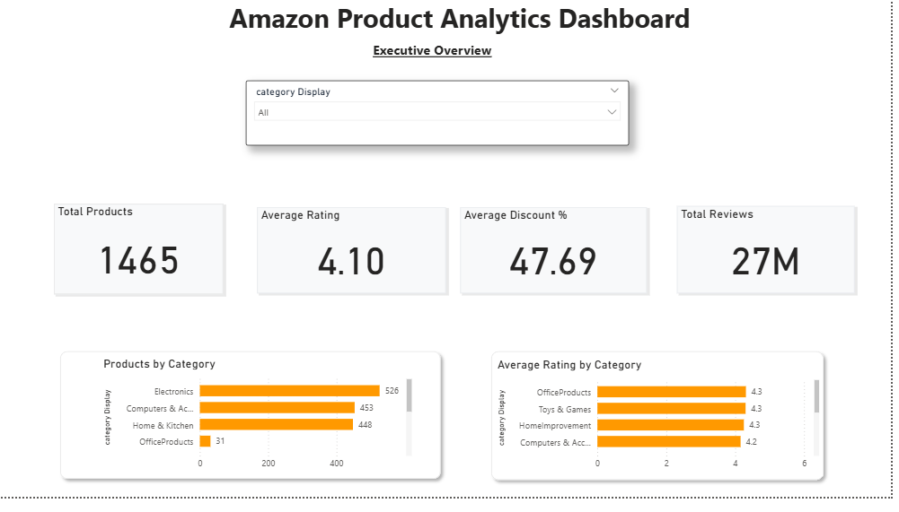
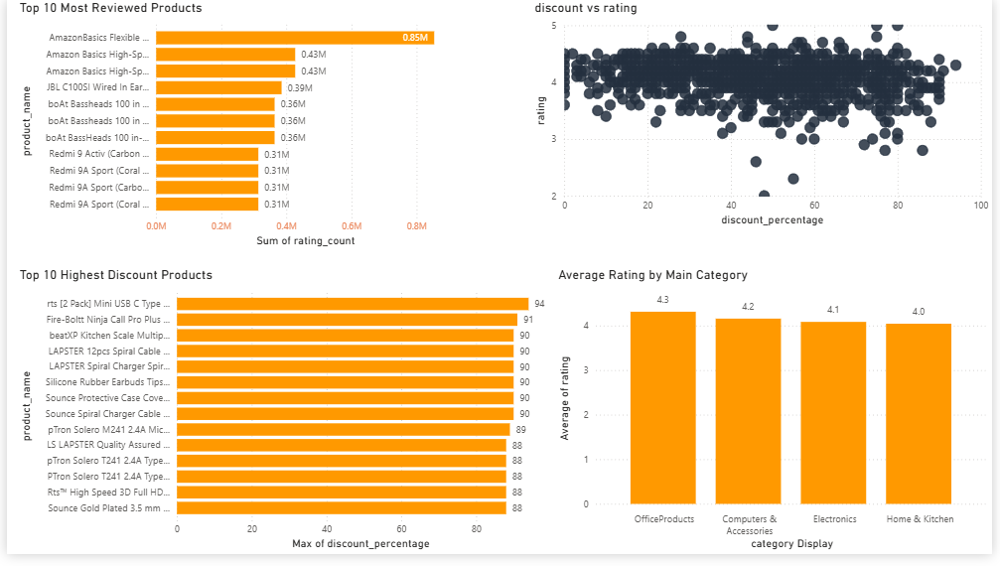

# 🛒 Amazon Product Analytics Dashboard

An end-to-end Data Analytics project built using **Python, Pandas, and Power BI** to analyze Amazon product data and generate actionable business insights.

---

## 📌 Project Overview

This project focuses on transforming raw Amazon product data into meaningful business insights through:

- Data Cleaning & Transformation
- Exploratory Data Analysis (EDA)
- Feature Engineering
- Business Insight Generation
- Interactive Power BI Dashboard Development

The objective was to understand customer engagement, product ratings, discount strategies, and category performance across Amazon products.

---

## 📊 Dataset Information

**Source:** Kaggle Amazon Product Dataset

### Dataset Size

| Metric | Value |
|----------|----------|
| Total Products | 1,465 |
| Categories | Multiple |
| Reviews | 26.7 Million+ |
| Average Rating | 4.10 |
| Average Discount | 47.69% |

---

## 🛠️ Tech Stack

- Python
- Pandas
- NumPy
- Power BI
- Git & GitHub

---

## 🔄 Project Workflow

### 1. Data Understanding

- Dataset Inspection
- Data Auditing
- Missing Value Analysis
- Data Type Validation

### 2. Data Cleaning

Performed:

- Removed ₹ currency symbols
- Removed commas from numeric values
- Converted prices to numerical format
- Converted discount percentages to numeric values
- Cleaned review counts
- Handled missing values
- Created category hierarchy

### 3. Feature Engineering

Created:

- Main Category Extraction
- KPI Metrics
- Category-Based Aggregations
- Dashboard Summary Tables

### 4. Exploratory Data Analysis

Analyzed:

- Product Distribution
- Category Performance
- Customer Ratings
- Review Volume
- Discount Trends
- Product Popularity

### 5. Dashboard Development

Built an interactive Power BI dashboard with:

- KPI Cards
- Category Analysis
- Product Analysis
- Customer Engagement Metrics
- Discount Analysis
- Correlation Analysis

---

# 📈 Key Business Insights

## Product Distribution

Electronics, Computers & Accessories, and Home & Kitchen account for approximately **97% of all products** in the dataset.

---

## Customer Satisfaction

Computers & Accessories maintains one of the highest average ratings among major categories.

---

## Customer Engagement

Products generating the highest review volumes include:

- Amazon Basics HDMI Cables
- boAt Earphones
- Redmi Smartphones

These categories drive the majority of customer engagement.

---

## Discount Analysis

Several products offer discounts exceeding **90%**, particularly in accessories and smart device categories.

---

## Discount vs Rating Analysis

No strong relationship was observed between discount percentage and customer ratings.

This suggests that higher discounts do not necessarily lead to better customer satisfaction.

---

# 📊 Dashboard Pages

## Executive Overview

Features:

- Total Products KPI
- Average Rating KPI
- Average Discount KPI
- Total Reviews KPI
- Products by Category
- Average Rating by Category
- Category Filter

### Dashboard Preview



---

## Product Analysis

Features:

- Top 10 Most Reviewed Products
- Top 10 Highest Discount Products
- Discount vs Rating Scatter Analysis
- Category Rating Comparison

### Dashboard Preview



---

# 📂 Project Structure

```text
amazon-product-analysis/
│
├── data/
│   ├── amazon.csv
│   ├── amazon_clean.csv
│   └── amazon_final.csv
│
├── scripts/
│   ├── data_overview.py
│   ├── data_audit.py
│   ├── inspect_values.py
│   ├── clean_data.py
│   ├── feature_engineering.py
│   ├── product_analysis.py
│   ├── category_analysis.py
│   └── dashboard_kpis.py
│
├── dashboard/
│   └── Amazon_Product_Analytics.pbix
│
├── screenshots/
│   ├── executive_overview.png
│   └── product_analysis.png
│
├── README.md
├── requirements.txt
└── .gitignore
```

---

# 🎯 Skills Demonstrated

- Data Cleaning
- Data Transformation
- Exploratory Data Analysis
- Feature Engineering
- Data Visualization
- Business Intelligence
- Dashboard Design
- Data Storytelling
- Power BI
- Python Programming

---

# 🚀 Future Improvements

- Sentiment Analysis on Customer Reviews
- Product Recommendation Insights
- Sales Forecasting
- Advanced DAX Measures
- Interactive Drill-Through Reports

---

# 👨‍💻 Author

**Shivi Tiwari**

- Integrated B.Tech + M.Tech (Information Technology)
- International Institute of Professional Studies (IIPS), DAVV
- Aspiring Data Analyst & Full Stack Developer

---